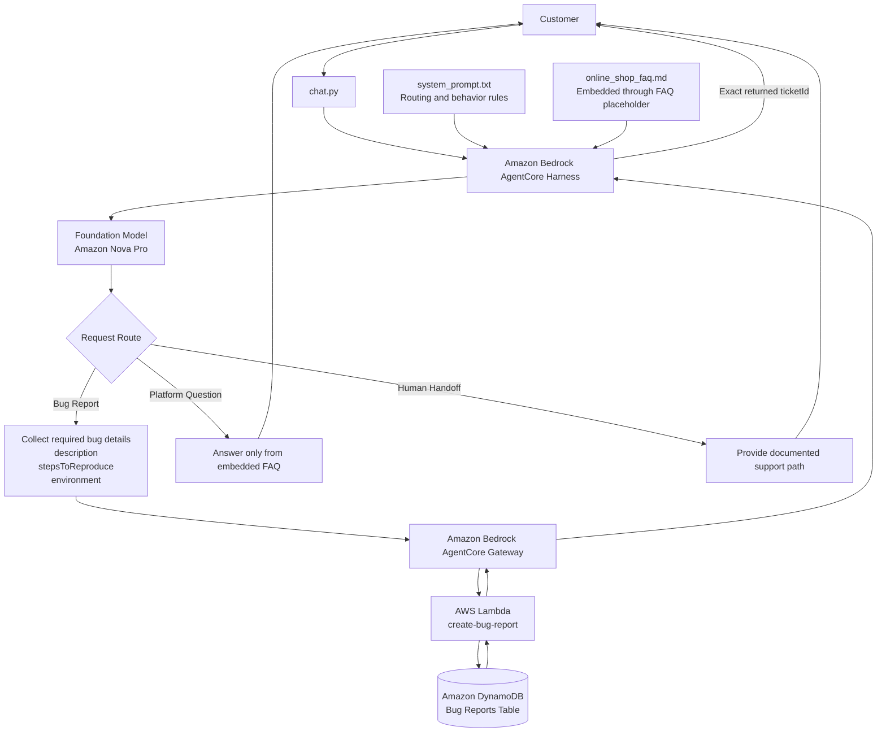

# Customer Support Chatbot Architecture

## Component Responsibilities

### Amazon Bedrock AgentCore Harness
Hosts the customer-support agent and applies the system prompt that governs routing, FAQ grounding, bug-report collection, tool use, and human handoff behavior.

### System Prompt
`system_prompt.txt` defines the three logical request routes:

1. Bug Report
2. Platform Question
3. Human Handoff

### FAQ Knowledge
`online_shop_faq.md` is inserted into the system prompt through the `{{FAQ}}` placeholder during harness creation.

Platform questions must be answered from this supplied FAQ rather than unsupported model knowledge.

### AgentCore Gateway
Provides the agent with access to the bug-report backend tool.

For bug reports, the agent collects:

- `description`
- `stepsToReproduce`
- `environment`

Only after the required fields are available should the bug-report tool be invoked.

### AWS Lambda
The bug-report Lambda function receives the structured bug-report information from the AgentCore Gateway and creates a new support ticket.

### Amazon DynamoDB
Stores the created bug report, including the generated ticket ID and ticket status.

### Ticket Response
After successful ticket creation, the exact `ticketId` returned by the backend tool is relayed to the customer.

## End-to-End Bug Report Path

Customer
→ `chat.py`
→ AgentCore Harness
→ Bug-report routing
→ Required field collection
→ AgentCore Gateway
→ Lambda
→ DynamoDB
→ returned `ticketId`
→ Customer